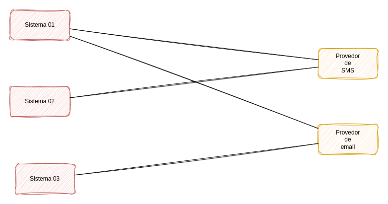
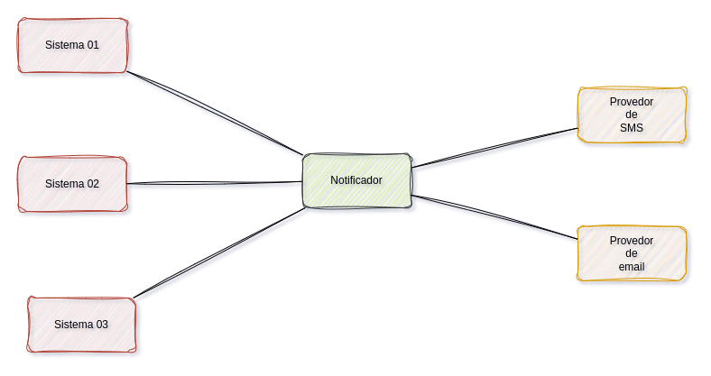

<h1 align="center">

</h1>
<h1 align="center">
Newton - Notificador
</h1>

Esse sistema foi desenvolvido para facilitar o gerenciamento no envio de e-mails pelos sistema de uma organização, o objetivo principal é fazer com que a configuração de envio de emails seja feita apenas uma vez no sistema de notificações, dessa forma todos os sistemas da organização poderão enviar emails bastando apenas uma chamada HTTP ao Notificador e o mesmo se responsabiliza pelo resto.

## Problemas resolvidos

1. Uma única configuração para que todos os sistemas possam enviar notificações;
2. Facilmente configurável, caso o provedor mude a configuração precisa ser feita apenas uma vez;
3. A requisição de envio de emails e SMS passam a ser facilitadas pois ela é feita por uma chamada HTTP junto com um Token de acesso.
4. Todos os registros de envio de notificações ficam salvos e organizados em um local;
5. Os erros no envio são registrados de forma simples e podem ser visualizados nos detalhes de um envio.

## Descrição detalhada do fluxo das notificações

O fluxo comum para o envio de emails e SMS é a configuração dos provedores em cada um dos sistemas da empresa, portanto, para cada sistema que precisa enviar um email há uma série de configurações que precisam ser feitas que o processo funcione corretamente.

Observe a imagem abaixo para entender melhor:



Observe que na imagem acima temos 3 sistemas que servem de exemplo para a explicação, o primeiro sistema faz envio de emails e SMS, o segundo faz o envio de SMS somente, o terceiro faz envio de emails somente.

Cada um dos sistemas possuem configurações próprias para que o envio de notificações possa ser realizado, se por acaso o segundo sistema precisar enviar email o mesmo deverá ser configurado para isso, o mesmo se aplica ao terceito sistema para o caso de envio de SMS.

## Fluxo do Notificador

O notificador funciona como uma camada que fica entre os sistemas e os provedores de email e SMS.



O Notificador configura todas as funcionalidades necessárias para o envio de emails e disponibiliza uma chamada HTTP junto com um Token para que os sistemas possam fazer requisições, dessa forma o Notificador faz todo o serviço de envio de emails e SMS.


## Configuração

Antes de executar a aplicação, crie um arquivo chamado **.env** com o conteúdo do arquivo **.env-example**:

```
# Geral
SECRET_KEY=algumacoisadificil
ALLOWED_HOSTS='localhost,127.0.0.1'
CSRF_TRUSTED_ORIGINS='http://localhost,http://127.0.0.1'
DEBUG=True

# Portas
APP_HTTP_PORT=80
APP_HTTPS_PORT=443

# Mail
EMAIL_HOST=
EMAIL_PORT=
DEFAULT_FROM_EMAIL=
EMAIL_HOST_USER=
EMAIL_HOST_PASSWORD=
EMAIL_USE_TLS=True

# Database (Production)
DB_DATABASE_NAME='postgres'
DB_USER='postgres'
DB_PASSWORD='postgres'
DB_HOST=db
DB_PORT=5432

```

**Há 4 (quatro) formas de configurar o sistema:**

### 1. Utilizando diretamente o Python para executar aplicação no terminal

Execute os seguintes comandos para executar a aplicação utilizando o Python:

```
# Aplicar os schemas no banco de dados
python manage.py migrate --settings=notificador.settings.dev

# Criar um usuário para acessar o sistema
python manage.py createsuperuser --settings=notificador.settings.dev

# Rodar a aplicação
python manage.py runserver --settings=notificador.settings.dev
```

### 2. Utilizando o arquivo de configuração do VSCode:

Execute os seguintes comandos para executar a aplicação pelo VSCode.
Esse método necessita do arquivo .vscode/launch.json

**Conteúdo do arquivo launch.json**

```json
{
    "version": "0.2.0",
    "configurations": [
        {
            "name": "Depurador do Python: Django",
            "type": "debugpy",
            "request": "launch",
            "program": "${workspaceFolder}/manage.py",
            "args": [
                "runserver",
                "--settings=notificador.settings.dev",
            ],
            "django": true,
            "autoStartBrowser": false
        }
    ]
}
```

**Comandos para executar a aplicação**

```
# Aplicar os schemas no banco de dados
python manage.py migrate --settings=notificador.settings.dev

# Criar um usuário para acessar o sistema
python manage.py createsuperuser --settings=notificador.settings.dev

# Rodar a aplicação
# precione a tecla "F5" para executar a aplicação
```

### 3. Executar a aplicação na versão de desenvolvimento com Docker

Execute os seguintes comandos para executar aplicação com Docker na versão de desenvolvimento.

```
# Executar os containers necessários
docker compose up -d

# Aplicar os schemas no bando de dados
docker compose exec web python manage.py migrate --settings=notificador.settings.dev

# Criar um usuário para acessar o sistema
docker compose exec web python manage.py createsuperuser --settings=notificador.settings.dev
```

### 4. Executar a aplicação na versão de homologação com Docker

Execute os seguintes comandos para executar aplicação com Docker na versão de homologação.

```
# Executar os containers necessários
docker compose -f docker-compose.homol.yml up -d

# Aplicar os schemas no bando de dados
docker compose exec web python manage.py migrate --settings=notificador.settings.prod

# Criar um usuário para acessar o sistema
docker compose exec web python manage.py createsuperuser --settings=notificador.settings.prod
```

### 5. Executar a aplicação na versão de deploy com Docker

A versão de deploy necessita de informações adicionais, uma delas é a configuração de certificados para que o HTTPS possa ser configurado corretamente.

Os certificados devem ser colocados no diretório **./dockerfiles/nginx/cert/**.

Observe que no arquivo **default.conf** há uma chamada para os certificados.

> default.conf
```conf
# SSL
ssl_certificate /etc/nginx/cert/cert.crt;
ssl_certificate_key /etc/nginx/cert/cert.key;
```

O nome dos arquivos de certificados devem ser colocados no lugar dos arquivos **cert.crt** e **cert.key**, se o nome dos seus arquivos forem diferentes faça as alterações de acordo com as suas necessidades.

> Comandos
```
# Executar os containers necessários
docker compose -f docker-compose.deploy.yml up -d

# Aplicar os schemas no bando de dados
docker compose -f docker-compose.deploy.yml exec web python manage.py migrate --settings=notificador.settings.prod

# Criar um usuário para acessar o sistema
docker compose -f docker-compose.deploy.yml exec web python manage.py createsuperuser --settings=notificador.settings.prod
```